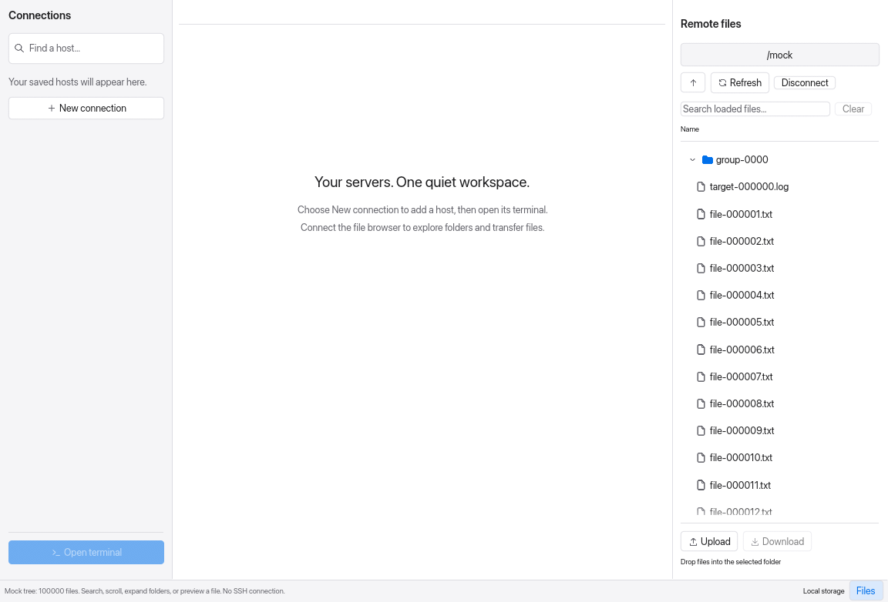

# Remote tree performance

The tree now caches case-folded names, search results, and flattened display rows. Repainting and scrolling lay out only viewport rows. Directory snapshots are shared instead of cloning whole listings on every frame. Query, root, listing, and expansion changes invalidate the relevant cache. Refresh uses indexed membership checks, and directory sorting computes its case-folded keys once.

## Measured results

Release builds on this macOS/aarch64 machine, with Rust 1.98.1. Each case uses three warm-up frames and 21 measured frames. These are **headless CPU times for application UI layout and paint-command generation**, with a 1280 × 800 viewport. They exclude GPU presentation, SSH latency, real transfer throughput, and fixture construction. The fixture contains either one flat directory or groups of 100 files, with all groups expanded.

| Files | Flat tree redraw before | After | Changed search query before | After |
| ---: | ---: | ---: | ---: | ---: |
| 1,000 | 1.085 ms | 0.033 ms | 1.218 ms | 0.173 ms |
| 10,000 | 11.908 ms | 0.033 ms | 13.841 ms | 1.481 ms |
| 100,000 | 152.938 ms | 0.033 ms | 175.104 ms | 16.127 ms |

Values are medians. At 100,000 files, the nested fixture measured 0.034 ms for a cached redraw and 16.395 ms for a changed query. Changing a query still scans the loaded tree and rebuilds results; the caches retain only the current query. They trade additional memory proportional to the loaded tree for less repeated work. No process-memory or end-to-end FPS claim is made here.

[All 30 cases, including p95](comparison.md) · [Before samples and source hashes](before.json) · [After samples and source hashes](after.json)

`query_change` alternates between `file` (broad matches) and `target` (about 1% of files), including the first redraw for each changed query. Other cases measure repeated frames with an unchanged query: unfiltered, broad, narrow, and no matches. Results are observations from this machine, not portable timing guarantees. Before measurements were captured before editing the implementation; the fixture names, sizes, scenarios, and timed frame boundary are the same in both runs.

## Repeat the benchmark

From the repository root:

```sh
cargo run --release --locked --example tree_bench -- /tmp/relay-tree-results.json 21
python3 scripts/check_tree_bench.py docs/benchmarks/before.json /tmp/relay-tree-results.json
```

The benchmark uses only in-memory listings and asserts that rendering and searching send no worker requests. No remote server is required. The compiler's release configuration is `opt-level=3`, thin LTO, and one codegen unit.

Optional p95 budgets, which passed on this machine:

```sh
python3 scripts/check_tree_bench.py docs/benchmarks/before.json /tmp/relay-tree-results.json --max-redraw-ms 1 --max-query-ms 25
```

Choose budgets appropriate for the machine running them. The checker exits nonzero when a budget is exceeded or workload metadata differs. The regular unit tests enforce deterministic cache reuse and bounded row rendering without relying on wall-clock thresholds.

## Interactive mock

```sh
cargo run --release --locked --example visual_preview -- --interactive 1440 978 large 100000
```

This opens a separate **Relay — Mock preview** window with 100,000 generated files and 1,000 folders. Try searching `target`, `file-099999`, or a folder name; expand or collapse folders; drag the scrollbar to the bottom; select a file to preview its generated content. Lists, refreshes, and previews are supplied from memory. The fixture does not connect to an SSH host or write remote files. Change the last argument to `1000` or `10000` for smaller trees. Close the window to finish.

For a framebuffer capture that closes automatically:

```sh
cargo run --release --locked --example visual_preview -- /tmp/relay-tree.ppm 1440 978 large 100000
```



## Validation

The application tests cover 1,000, 10,000, and 100,000 files, with at most 12 painted rows in a 350-pixel tree viewport; scrolling to and selecting the last file; search cache reuse; refresh invalidation; filtered expansion; restoring expansion after clearing a query; and absence of automatic remote requests from search or scrolling. The existing localhost SFTP integration test also passed after changing sorting. Formatting and Clippy pass.
