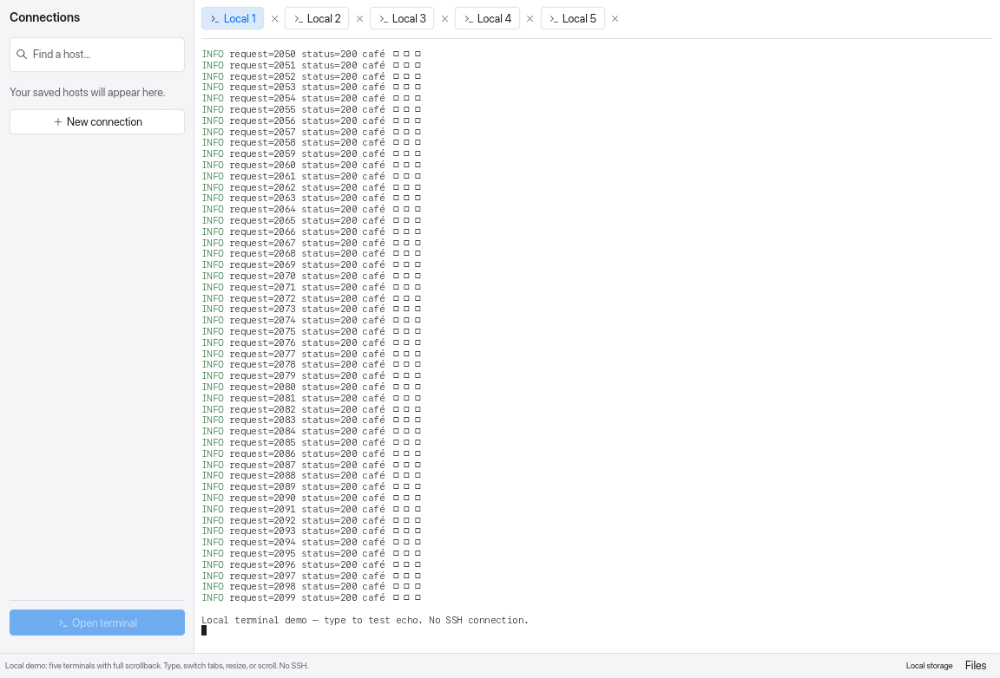

# Terminal performance

Terminal redraws now reuse visible-cell snapshots, paint commands, and glyph layouts. Full scrollback stays in the terminal emulator instead of being cloned on every frame. Themes and default bindings share their immutable data. Glyph layouts retain at most 2,048 distinct characters per terminal; closing a tab releases its paint cache.

Output notifications are coalesced before entering the UI channel. Hidden tabs continue parsing output and retaining history, but do not queue content redraw notifications. Lifecycle and protocol events, including process exits, still reach the application. Activating a tab refreshes its snapshot.

## Measurements

Release builds on macOS/aarch64 with Rust 1.98.1, thin LTO and one codegen unit. Both runs use the same benchmark workload and counting allocator, five warm-up UI frames per case, and 31 measured samples. Each terminal starts with a full 2,000-line scrollback. The 48 cases cover 1, 5, and 10 tabs at 1280 × 800 and 1920 × 1080.

These are **headless CPU times for ANSI parsing plus application UI layout and paint-command generation**. They exclude PTY/network latency, GPU tessellation/presentation, and fixture construction. Allocation bytes are cumulative requested bytes during a measured operation, including reallocations; they are **not resident memory or retained heap size**. Allocator instrumentation adds overhead to both runs.

| Case | Before median | After median |
| --- | ---: | ---: |
| Idle redraw, 1 tab, 1280 × 800 | 0.684 ms | 0.029 ms |
| Single-byte echo, 1 tab, 1280 × 800 | 0.648 ms | 0.074 ms |
| 20 colored output lines, 1 tab, 1280 × 800 | 0.661 ms | 0.081 ms |
| Scrollback, 1 tab, 1280 × 800 | 0.660 ms | 0.067 ms |
| Resize, 1 tab, 1280 × 800 | 0.693 ms | 0.181 ms |
| Idle redraw, 10 tabs, 1920 × 1080 | 1.015 ms | 0.044 ms |
| Output in all 10 tabs, 1920 × 1080 | 1.182 ms | 0.224 ms |

At 1280 × 800 with one tab, idle allocations fell from 6,692 to 113 (98.3% fewer), and allocation volume from 7,110,447 to 207,558 bytes (97.1% less). The largest measured p95 across the optimized cases was 0.308 ms, during a 10-tab resize at 1920 × 1080. These observations are machine-specific, not portable timing guarantees or end-to-end FPS measurements.

[All cases and allocation measurements](comparison.md) · [Before samples and source hashes](before.json) · [After samples and source hashes](after.json)

`typing_echo` feeds one byte through the parser; it does not measure a keyboard-to-screen round trip. Output cases feed 20 lines per targeted terminal. `inactive_output` still forces a headless UI frame to measure its cost; the one-tab case has no hidden producer. It does not measure the event-loop benefit of suppressing hidden-tab redraws. A deterministic test separately verifies that 10,000 visual events across ten tabs queue one content notification for the visible tab, and that hidden exits and accumulated output are preserved. Resize alternates the viewport width by 160 points; scrollback alternates two lines in each direction.

## Repeat and enforce budgets

```sh
cargo run --release --locked --features terminal-fixture --example terminal_bench -- /tmp/relay-terminal-results.json 31
python3 scripts/check_terminal_bench.py docs/benchmarks/terminal/before.json /tmp/relay-terminal-results.json
```

The fixture uses the real ANSI parser and application UI with in-memory terminals; it needs no SSH host. The `terminal-fixture` feature is only needed for this benchmark, not normal builds.

Optional p95 and allocation-volume budgets, which passed on this machine:

```sh
python3 scripts/check_terminal_bench.py docs/benchmarks/terminal/before.json /tmp/relay-terminal-results.json --max-idle-ms 0.25 --max-active-ms 1 --max-allocated-bytes 2000000
```

Choose budgets for the machine running them. The checker exits nonzero on exceeded budgets or incompatible workload metadata. Regular tests assert cache reuse and correctness without timing thresholds.

## Native local-terminal mock

```sh
cargo run --release --locked --example visual_preview -- --interactive 1440 978 terminals
```

This opens five local shell PTYs, fills their scrollback with colored output, and runs `/bin/cat` for typing echo. Switch tabs, scroll, select text, and resize. No SSH connection is made. Close the window to stop the demo processes.

For an automatically closing framebuffer capture:

```sh
cargo run --release --locked --example visual_preview -- /tmp/relay-terminal.ppm 1440 978 terminals
```



The capture confirms the existing light appearance and colored Latin text. Japanese characters appear as missing-glyph boxes with the current font configuration. Unicode cell data and cached glyph mesh equivalence are tested; this change does not add font coverage or change the upstream renderer's combining-character behavior.

## Correctness checks

```sh
cargo test --locked --features terminal-fixture
cargo test --locked -p egui_term
cargo clippy --locked --all-targets --features terminal-fixture -- -D warnings
cargo clippy --locked -p egui_term --all-targets -- -D warnings
```

21 application tests and 13 terminal tests pass. The live SFTP test is ignored in the regular suite and was not rerun for these terminal-only changes. Terminal checks cover viewport snapshots against emulator cells, Unicode and color data, scrollback, selection, resizing, alternate-screen mode, typing, bracketed paste, cache invalidation for font/theme/DPI/layout changes, bounded glyph retention, custom-binding isolation, and hidden-tab notifications and exits.
